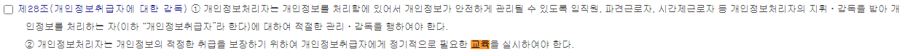
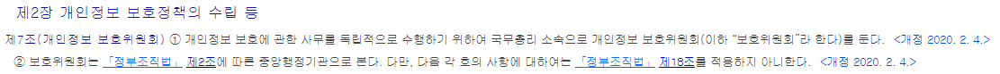
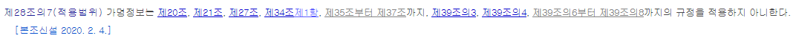

# 개인정보 (21.11.08)

결합가능성 : 합리적인 비용 내에 처리가능할 경우

OECD 프라이버시 8원칙

가명정보 : 결합하면 알수있음  <--> 결합해도 알 수 없음, 법적용 대상이 아님

수집목적 : 합려적인 관련 업무 가능토록 법 개정

개인정보보호법으로 일원화함

중요사항 : 9포인트 이상,  20% 이상 크게, 색깔/굵게/밑줄 등으로 구분

영상정보처리기기 : 녹음안됨, 탈의실 등 불가

관리자의 권한변경 사항 : 3년간 보관

접속기록 : 최소 1년 이상 보관

비밀번호 : 일방향 암호화 

 

[개인정보보호법](https://www.law.go.kr/%EB%B2%95%EB%A0%B9/%EA%B0%9C%EC%9D%B8%EC%A0%95%EB%B3%B4%EB%B3%B4%ED%98%B8%EB%B2%95)

 

[개인정보보호위원회](https://www.pipc.go.kr/np/)

가명정보 적용 특례 (개인정보보호법 제28조의7)

  - 제20조 : 정보주체 이외로부터 수집한 개인정보의 수집 출처 등 고지

  - 제21조 : 개인정보의 파기

  - 제34조제1항 : 개인정보가 유출되었음을 알게 되었을 때에는 지체없이 해당 정보주체에게 알림

  - 제35조 ~ 제37조 : 개인정보의 열람, 개인정보의 정정삭제, 개인정보의 처리정지 등

  - 제 6장 정보통신서비스 제공자 등의 개인정보 처리 등 특례 부분

  - 제39조의3 : 개인정보의 수집이용 동의 등에 대한 특례

  - 제39조의4 : 개인정보 유출등의 통지신고에 대한 특례

  - 제39조의6 ~ 8 : 개인정보의 파기에 대한 특례, 이용자의 권리 등에 대한 특례, 개인정보 이용내역의 통지

 

[털린 내 정보 찾기 서비스](https://kidc.eprivacy.go.kr/)

별루

하루에. 하나의 이메일계정 인증으로 5개까지 확인 가능 : 뭐지? 

자신이 사용하는 아이디 및 패스워드 입력해야 함