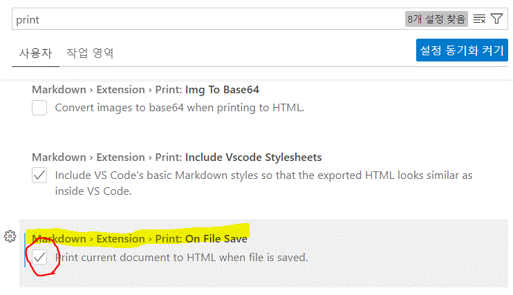

# MY BLOG

## 1. github

## 2. VSC

## 3. markdown (MD)
1. [markdown guide](https://www.markdownguide.org/basic-syntax/)

## 4. markdown all in one in VSC
1. [markdwon all in one in VS Code](https://marketplace.visualstudio.com/items?itemName=yzhang.markdown-all-in-one) 

## 5. 블로그 작성 방법

A. daum BLOG 망함

B. 로컬 작성하여 서버에 올림
  - VSC에서 Markdown으로 작성하고 Github에 올림

 

---

 

1. md 파일을 html로 자동변환
   
   VSC에서 옵션 설정 : "Markdown > Extension > Print: On File Save"
   

 

1. 기타등등 정리중

URL 복사후 Ctrl+V 하이퍼링크 복사
 

**normal**
bold
-[x] todo

1. md 파일 작성
2. 미리보기 설정 (상단 위 : Ctrl+K V)
3. ctrl + spacebar : 자동완성 (뭐하는건지 모르겠네)

# 제목1 
## 제목2 : 샵 2개 
### 제목3 
#### 제목4
##### 제목5
###### *제목6*

*이태릭* * ctrl+I

**볼드** ** ctrl+B

***이태릭두껍게*** *** 

~~취소선~~

인용문
> 가나다라
> > 가나다라
> > > 가다다라

원시 HTML도 가능함

MD 문서 작성후 Markdown Monster를 활용하여 HTML로 변환

  
줄바꿈 : 엔터키 2번 또는 br tag

수평선 만들기 - 또는 * 또는 _를 3개 이상

___
