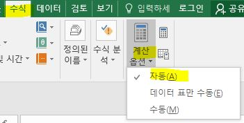

# 엑셀 셀

- [엑셀 셀](./office_0001.html)
- [엑셀 수식](./office_0008.html)
  

 

## **015. 수식이 최신화가 안 될 때**

  - 파일 - 수식 - 계산- 계산옵션 - **자동**
  
  

 

## **014. 수식인지 여부 (isformula)**

  - 관련함수 다수 : isblank, iserror, isodd,,,

 

## **013. 날짜 계산 (datedif,  workday)**
  - datedif 날짜 계산 (20. 11. 02)

    . datedif(A1, A2, "D")  /* Y, M, D  vs  Y+YM+YD */

    . 다른 툴과의 호환성을 위해서 만든 것이라고 함,  없는 것처럼 보이더라도 직접 입력하면 작동됨

  - workday 근무일자 계산 (22. 03. 05)

    . workday(날짜, 숫자, 휴입)  /* 날짜로부터 근무일이 숫자날짜만큼인 일자 계산 (휴일 별도 관리 가능) */

    . wrokday(pcr검사일 + 6일 + 본인감염여부( 3 or 0),  1,  휴일달력)  /* 출근 예정일 계산 */

 
 

## **008. 변환 (value, date, datedif, char, code, text)**
  - value (21. 11. 23)

    . 텍스트를 숫자로 바꾸어짐

  - date 텍스트를 날짜로 변환 (20. 11. 02)

    . date(년, 월, 일)

 

  - char  vs.  code

    . char( code('a') + 1 )  --> 'b'

  - text (원하는 형식으로 데이터 저장)

    . text(value, format_text)

    . yyyy, mm, dd, hh, mm, ss

    . 셀서식 내용 참조하면 좋을 듯

 

## **002. 드롭박스**
. 드롭다운 목록을 만들고 싶은 셀을 선택

-> [데이터] -> [데이터유효성검사] -> [제한대상] -> [목록] 선택

->[공백무시]와 [드롭다운표시]에 체크 -> [원본]란에 원하는 리스트를 쉼포로 구분하여 입력하고 확인

. 셀영역을 지정하여 처리할 수도 있음

 

## **001. 셀 보호하기**
. Ctrl-A - 셀서식 - [보호]탭 - 잠금. 숨김 항목 체크 해제 - 확인

. 수식이 들어 있는 셀 범위 지정 - 우클릭 - 셀서식 - [보호]탑 - 잠금, 숨김 ㅞ크 - 확인

. [도구]-[보호]-[시트보호] '워크시트에서 허용할 내용', 잠긴셀 선택, 잠기지 않은 셀 선택 체크

Tip [시트보호] 대화상자에서 [시트보호 해제암호]항목을 이용하여 암호를 지정하면 [도구]-[보호]-[시트보호해제] 메뉴를 실행할 때 암호를 입력해야 한다.