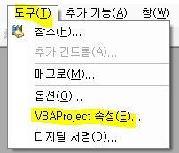
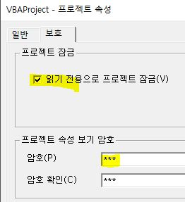

# 엑셀 수식

- [엑셀 셀](./office_0001.html)
- [엑셀 수식](./office_0008.html)
  

 

## **24.12.01 새창**
## **24.11.XX 하이퍼링크 - 이름**

 

### **○ 창을 여러 개 띄워 놓고 작업하기**
- 하나의 엑셀 파일에서 여러 개의 시트를 띄워 놓고 작업하기
- **새창** 띄우기
- 창들 이쁘게 배열해서 작업하면 됨, 각 창에서 다른 시트 보면서 작업하면 됨, 동일한 시트 보고 있으면 동시에 바뀜

 
  

### **1. 매크로 삭제**
- 매크로 소스 보기 : **Alt + F11**
- 매크로 삭제 : 트리 구조에서 마우스 오른쪽 버튼 - 삭제
- 도구 - VBAProject 속성
  - 읽기전용 체크 : 소스 안보이게 패스워드 확인함
  - 프로젝트 속성보기 암호 : 별루, 말그대로임, 프로젝트 속성볼 때 패스워드 묻는 것으로 이것만하면 매크로 수정 가능

  

  

 
  

### **2. 매크로 만들기 (007)**
- 보기 - 매크로 - 매크로 기억 [매크로명, 단축키(ctrl+영문자) ]
- 잡다한 작업들,,,
- 보기 - 매크로 - 매크로 종료

 

## **012. 그룹 (묶음처리 : 숨김처리)**
  . 데이터 - 그룹  (선택하면 만들면, 그 다음 줄(열)에 ± 버튼이 생김

 

## **011. sumifs, countifs**
  . 주위에서 사용하는 것을 보고 관심이 가지게 된 함수

  . 기존 조건절을 여러 개를 사용할 수 있게 된 것임

 
 

## **010. 이름정의**
  . 영역을 특정한 이름으로 정의하여 관리

  . 셀속성에서 이름 정의

  .  <수식 - 이름관리자>에서 수정 가능

 
 

## **009. offset**
  . 지정한 위치에서 이동

  . offset(영역, row, col)

 
 

## **006. 조건부서식 : 조건절 추가**
. =OR($A2="X") : A2셀이 "X"인 경우 조건부서식 적용

주의) 여러줄 적용시 $ 값 잘 사용합시다 ^^

 
 

## **005. hyperlink (함수를 활용해서 하이퍼링크 만들기)**
- hyperlink ("URL", "텍스트명")
- hyperlink ("#'시트명'!A1", "바로가기") : 현재 열려져 있는 파일의 하이퍼링크
- 이름영역도 동일하게 사용하면 됨 "#N이름"
 
 

## **004. indirect (주소값을 활용하여 셀 값 가져오기)**
. indirect( 셀주소 ) : "TASK_LIST!C" & A4

 
 

## **003. match (vlookup 이상)**
. vlookup( 1, 2, 3, 4)

1 : 찾고자 하는 값

2 : 찾을 영역

3 : 찾았으면 몇번째 값을 가져갈까요?

4 : false : 정확하게 일치하는 값을 찾음 (주의)

. match : 3번째 값을 숫자로써 정의하지 않고 필드명으로 정의 : 변경시 관리 쉬움

vlookup (1, 2, match(컬럼명셀값, 컬럼명배열, false), false)

 
