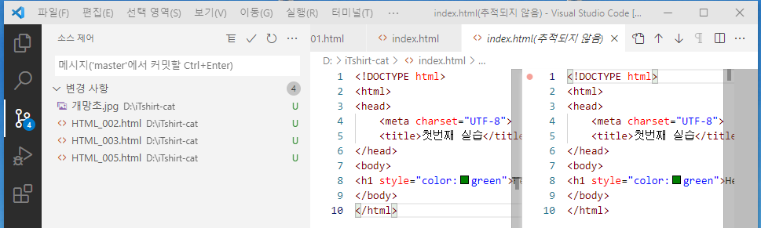

# VSC

## 1. 컬럼단위 글쓰기

Ctrl + Alt + 화살표 위 또는 아래

 

## 2. 다운로드 & 설치

[설치 URL](https://code.visualstudio.com/Download)

 

## 3. 마켓플레이스에서 중요한 것들 설치

    한글설치 : Korean Languange Pack for Visual Studio Code
    브라우저 : open in browser
    마크다운 : Markdown All in One

    추천 5종 팩
    . Auto Close Tag : 태그 자동 입력 (<>, </>)
    . HTML Snipper : <> 없어도 태그 완성 : 꺽쇠 없이 div 후 엔터키
    . Live Server : 자동 저장 기능
    . Material Icon Theme : 언어별 아이콘 부여
    . Prettier : 코드 배치 이쁘게

### 3.1 Korean Languange Pack for Visual Studio Code

- 메뉴를 한글로 표시함

### 3.2 open in browser

- Alt + B : html 내역을 브라우저에서 오픈

### 3.3 Markdown All in One

 

## 3. 화면 설명

    탐색기
    검색
    소스제어(Git)
    실행 및 디버그
    확장 (마켓플레이스)

 

## 4. 소스관리 / Git

   1. Refresh : 소스제어에서 어떤 것들이 바뀌었는지 확인

   2. 필요한 파일 Staging Area로 이동 

   3. 커밋 메시지 작성
   
   4. 커밋 : 전후 파일 내역이 동일해짐

 

## 5. 색테마

파일 - 기본설정 - 색테마

