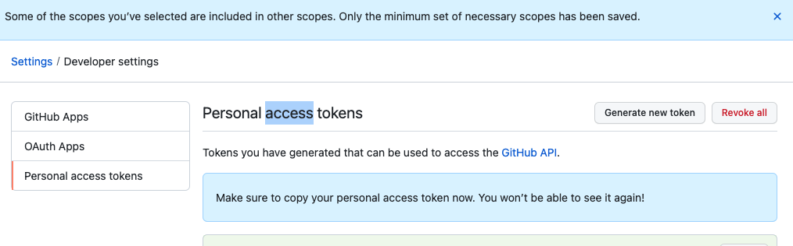

# Git / GitHub 첫 사용하기

## 1. 빈  git 만들기

  git init

  ==> Initialized empty Git repository in /Users/sk/Documents/,,,
 
 

## 2. 연결

  git remote add origin https://github.com/github_id/repository_name.git 
 
 

## 3. github에서 로컬로 가져오기

  git pull origin master
 
 

## 4. 기본 설정 합시다. 원하지 않는 값으로 들어갑니다.

git config --global user.name "name"

git config --global user.email "email"

git reset HEAD^  // 커밋한 것 중에서 마지막 1개 취소

 

## 5. github 개인키 인증

  setting - Developer settings - Personal access tokens - Generater new token : 1번 만들고 아래쪽 Key값 별도 저장 필요
 

