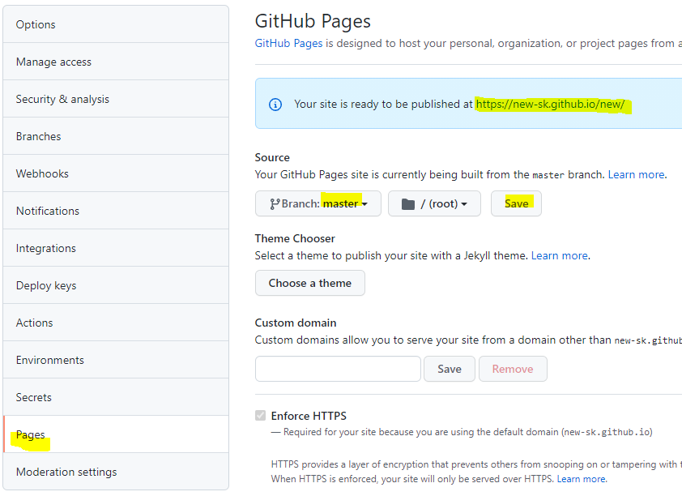
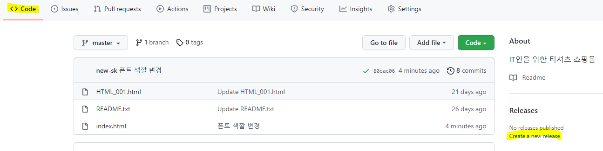
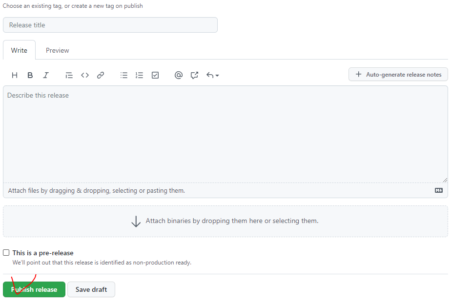
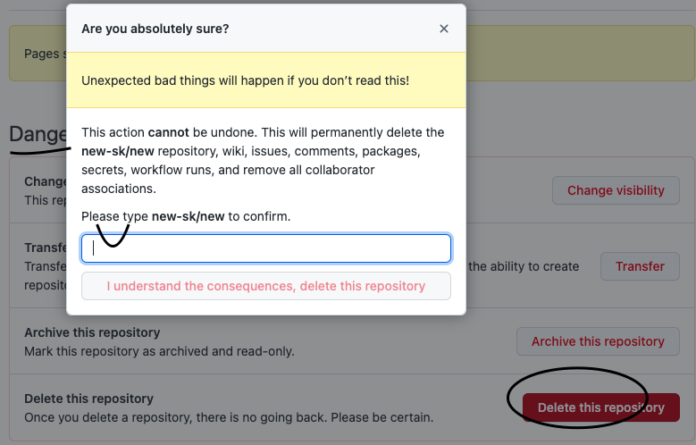
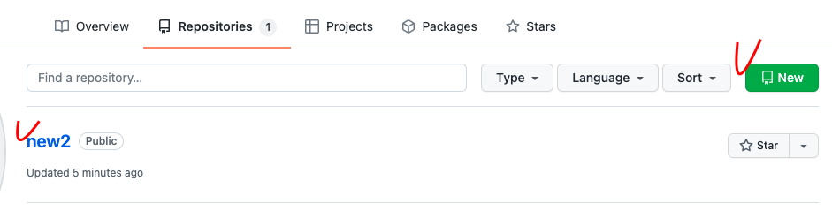
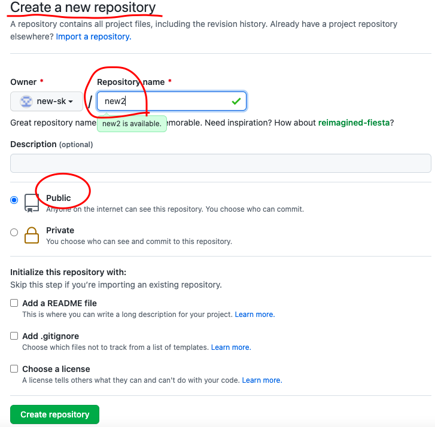

# 웹호스팅

## 1. github repository 생성  : public으로 해야 함

- 소스수정 (로컬)

- 소스반영 (Github 반영) git push origin master
  

 
  

## 2. 변경내역 반영

  - Code - Releases

  - Publish release

  

## 3. repository 폭파후 새로 만들기

Repository 삭제

  - setting / 가장 아래 danger 영역에서 삭제 가능

 

새로 생성

  - 상단 오른쪽 초록색 버튼 "New"에서 새롭게 Repository 생성 가능

  - 하단 존재하는 repository 목록이 보임 (new2)

 

  - 신규 생성 할 때 내용 : 이름, public 여부 (난, public 나에게 서비스하기 위해)

