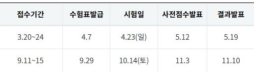

# DASP 23년 시험일정

 

1. 전사아키텍처 이행

1. 데이터 품질 관리 이해

2. 데이터 요건 분석

3. 데이터 표준화

4. 데이터 모델링

5. 데이터베이스 설계와 이용

[챗GPT에 모든 걸 맡기면 안 되는 이유 : 3PRO TV, 조봉한 깨봉수학 대표](https://www.youtube.com/watch?v=vCr6Frmritg&list=PLQvqXcm97CTCa3KE90z0rhBQKlxpNhzCG)