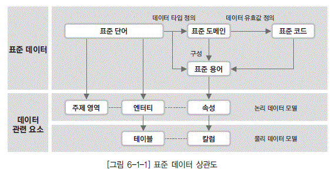

# 2-1. 데이터 이해

 <a href="./study_0115.html">0115. 2-1. 데이터 이해</a> 

 <a href="./study_0116.html">0116. 2-2. 데이터 구조 이해</a> 

 <a href="./study_0117.html">0117. 2-3. 데이터 관리 프로세스 이해</a> 

 

### **가. 데이터 품질 관리 프레임워크** 

데이터의 품질 요소에는 데이터 값, 데이터 서비스, 데이터 구조, 데이터 관리 프로세스 등이 있음

|  | 데이터 | 데이터 구조 | 데이터 관리 프로세스 |
| --- | --- | --- | --- |
| CIO/EDA(개괄적) <td colspan="3"> 데이터 관리 정책 </td> |
| DA(개념적) | 표준 데이터 | 개념모델, 데이터참조모델 | 표준관리, 요구사항관리 |
| Modeler(논리적) | 모델 데이터 | 논리모델 | 모델관리, 흐름관리 |
| DBA(물리적) | 관리 데이터 | 물리모델, 데이터베이스 | 데이터베이스관리 |
| User(운용적) | 업무 데이터 | 사용자뷰 | 활용관리 |

 

### **나. 표준 데이터** 

정의 및 관리 목적
- 데이터의 품질 확보와 직결되는 요소
- 데이터의 불일치나 오류 가능성 최소화 -> 생산성 향상, 의사소통 원할하게, 데이터 통합 효율적 수행 가능

세부 관리 대상
- 표준 단어 사전 : 표준성, 참조가능성, 일반성, 대표성
- 표준 도메인 사전 : 표준성, 유일성, 업무지향성
- 표준 용어 사전 : 표준성, 유일성, 업무지향성
- 표준 코드 : 재사용성, 일관성, 정보분석성
- 데이터 표준 요소 : 데이터 관련 요소의 표준화 : 주제영역, 데이터베이스, 인덱스,,,

표준 데이터 상관도

 

### **다. 모델 데이터** 

정의 및 관리 목적
- 데이터 구조에 대한 최신 정보 유지, 전사 차원 데이터 모델 공유, 체계적인 변경 관리

세부 관리 대상
- 완전성, 일관성, 추적성(변경이력추적), 상호 연계성, 최신성, 호환성(다른 종류의 관리 데이터와도 호환)

 

### **라. 관리 데이터** 

정의 및 관리 목적
- 데이터베이스를 효과적으로 운영, 관리하기 위해 필요한 데이터

세부 관리 대상
- 사용 관리 데이터 : 데이터 활용도(저장공간관리), 사용자 만족도(품질보증), 문제 해결 소요 시간
  - 관리방법 : 특정기간별 데이터 변경 현황 집계, 월별 데이터베이스 개선요구사항 분석, 문제발견경로 정의, 문제유형별 정리 및 처리결과 정리
- 장애 및 보안 관리 데이터 : 주기적인 상태 기록(백업주기,방법,안정한 데이터 보관, 정상적인 복구 여부), 복구 절차와 규칙, 접근 통제(데이터 안전성 보장)
  - 관리방법(장애) : 중요도 결정 (백업주기 결정), 백업/복구 절차 정립 및 주기적 교육(상세히, 중복/모순없도록), 별도의 안전한 위치에 저장
  - 관리방법(보안) : 보안규정 수립, 주기적인 교육/홍보, 사용자 접근권한 명시, 불법적 접근 모니터링
- 성능 관리 데이터 : 주기적인 성능 점검, 성능 향상 수단(절차와 규칙 정의)
  - 광리방법 : 측정기준 정량화, 추세 분석, SQL튜닝/구조변경 등 절차와 규칙 수립, 재구성 작업 시기/방법, 스토리지 교체/확장 
- 흐름 관리 데이터 : 매핑정보, 분석계 : 안정성, 유효성, 데이터정합성
  - 관리방법 : 매핑정확한지 여부, 삭제된 정보 아닌지, 사용안하는 항목 아닌지, 변환규칙 필요한지 여부
- 품질 관리 데이터 : 풍질기준, 품질점검주기, 절차와 규침, 개선절차
  - 관리항목 : 엔터티 무결성, 참조 무결성, 도메인 무결성, 비즈니스 규칙, 트리거 등 사용자 정의 객체, 데이터복제시 정합성

 

### **마. 업무 데이터** 

정의와 관리 목적
- 기관이나 기업의 업무 및 비즈니스를 수행하는 데 필요한 데이터

세부 관리 대상
- 원천 데이터 : 현실 세계에서의 데이터
  - 보안성, 안전성, 신뢰성
- 운영 데이터 : 데이터베이스에 관리되는 데이터
  - 정확성, 일관성, 최신성, 완전성, 사용용이서, 검색용이성
- 분석 데이터 : 운영데이터를 ETL(추출,변환,적재) 통해 구축
  - 분석주기, 마감기한, 요약레벨, 주제지향성, 통합성, 시계열성, 비휘발성
